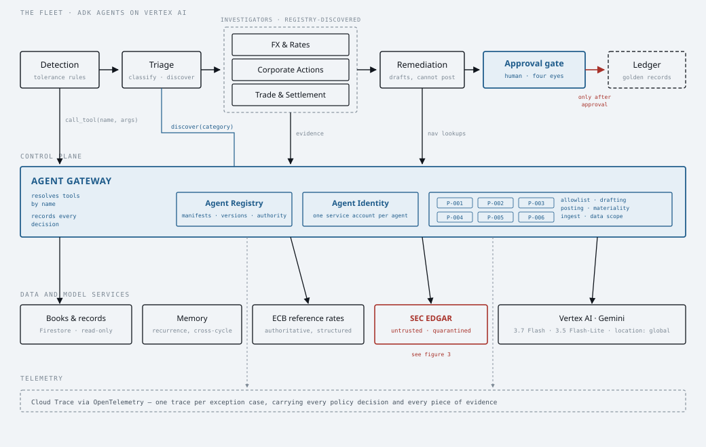

# NAV Sentinel

A governed fleet of fund-accounting agents that clears reconciliation exceptions inside the
NAV production window.

**Track C — The Fortified Enterprise Fleet** · All Things Agentic Hackathon

---

## The problem

Every day, every fund is reconciled twice: once by the fund accountant and once by the
custodian. When the two books disagree, someone has to explain the difference before the NAV
can be struck — and the window is measured in hours. The work is skilled, repetitive and
almost entirely manual: pull the break, guess the cause, chase the evidence across a price
feed, an FX table, a corporate-action notice and a trade blotter, then write the correcting
entry and find someone senior enough to approve it.

Agents can do most of this. The reason they don't is governance. No fund administrator will
let an autonomous process near a NAV without cryptographic identity, enforced separation of
duties, screening of anything ingested from outside, and an audit trail that survives a
regulator asking *why*.

So this project builds both halves: the fleet that does the work, and the control plane that
makes it deployable.

## What it does

1. **Detects** breaks between the accounting and custodian books using deterministic
   tolerance rules — no model, because deciding whether two numbers differ is arithmetic.
2. **Triages** each break, computes its NAV impact in basis points, and asks the **Agent
   Registry** which specialist is authorised to investigate that root-cause family.
3. **Investigates** in parallel via five specialists — corporate actions, FX and rates,
   pricing, settlement, cash and fees — each with its own identity, its own read-only tool
   allowlist, and evidence cited from authoritative sources.
4. **Drafts** a balanced correcting entry with the full evidence chain attached.
5. **Routes** for approval by materiality. Nothing posts autonomously, at any size.

### Definition of done is arithmetic, not assertion

A NAV difference is not another break to investigate — it is the **control total**. Every
other break is a candidate explanation for it. The cycle is complete only when the signed sum
of explained cases equals the NAV difference and the residual is zero:

```
MERID-GEF  control total          EUR -4529562.69
           less declared corrections  (closes to 0.00)
           6 scenarios across 3 capabilities, 2 NAV cycles
           residual        EUR        -0.00   complete
```

A model cannot declare victory here. The arithmetic either closes or it does not.

## Architecture

Four figures — the deployed architecture, the enforcement path, the quarantine boundary, and the
closure proof — are in [docs/diagrams/](docs/diagrams/), with the full write-up in
[docs/architecture.html](docs/architecture.html).

The figure below is the one to read first: triggers on the left, one container in the middle,
managed Google Cloud services on the right. The middle column is deliberately **generic** — the two
process packs are interchangeable and the control plane beneath them knows nothing about either.
Fund accounting measures materiality in basis points and transfer agency in units, and the same
`band_for` derives the approval band from both. An earlier version of this figure drew the
fund-accounting pipeline, which described one process rather than the platform that hosts any.



**Where Gemini sits:** the fleet is ADK 2.0 agents inside a single Cloud Run service, calling Vertex
AI at location `global` — Gemini 3.x is served from nowhere else — authenticated by Application
Default Credentials from the metadata server. There are no API keys in this project.

**Where state lives:** Firestore, in four collections. `nav_cases` is current state; observations,
decisions and approvals are **append-only**, written with `create()` rather than `set()`, so the
audit trail cannot be rewritten by a later run.

| Brief requirement | Google Cloud component | What we designed on top |
| :--- | :--- | :--- |
| Agent Registry | Agent Registry | Versioned YAML manifests declaring capability, tool allowlist, data scopes and authority. Triage resolves specialists by capability at runtime, so adding one is a publish, not a code change. |
| Agent Runtime | Agent Runtime / Cloud Run | Long-running investigations dispatched asynchronously over Pub/Sub. |
| Memory Bank | Memory Bank | Per-fund, per-security recurrence memory across NAV cycles, so a break seen last month is recognised rather than re-investigated. |
| Agent Identity | Agent Identity + IAM | One service account per agent, minted from its manifest. No shared fleet identity, no ambient authority. |
| Agent Gateway | Agent Gateway | Single enforcement point for the seven policies below. Subject resolved from the bound identity; tools resolved from a frozen catalogue. |
| Model Armor | Model Armor | Screens external content in overlapping windows, gated on all three response fields. Reduces what gets through; **not** the boundary — see below. |
| Observability | Cloud Trace via OTLP | One trace per exception case. The reasoning chain *is* the audit artefact. |

**Model:** `gemini-3.7-flash` on Vertex AI for investigation and drafting;
`gemini-3.5-flash-lite` for triage classification, which every break passes through and is
where token spend would otherwise run away.

> Note on the brief: it specifies "Gemini 3.5 or newer". Gemini 3.5 Pro had not reached
> general availability as of August 2026 — it missed its I/O target. We satisfy the
> requirement with Gemini 3.7 Flash, which is GA and better suited to agentic workloads.

### The eight enforced policies

| ID | Policy |
| :--- | :--- |
| `P-001-TOOL-ALLOWLIST` | An agent may call only the tools declared in its registry manifest. Grants cannot be made at runtime. |
| `P-002-DRAFT-AUTHORITY` | Only the remediation agent may draft an accounting entry. Investigators report root causes. |
| `P-003-NO-AUTONOMOUS-POSTING` | No published agent holds posting authority, so nothing reaches the ledger without a recorded human approval. An agent *could* be granted a narrow autonomous ceiling, but only within a band the control plane itself scores AUTO_CLEAR — a manifest can narrow its autonomy, never widen it. |
| `P-004-APPROVAL-ROUTE` | A unit-tagged magnitude and the tenant's thresholds determine who signs off; the control plane derives the band, the process never declares it: auto-clear, single reviewer, four eyes, or CIO escalation. Computed, never inferred. |
| `P-005-UNTRUSTED-INGEST` | An agent that reads the public internet cannot opt out of Model Armor screening. |
| `P-006-DATA-SCOPE` | A tool may only read the data domains its caller's manifest declares. |
| `P-007-EVIDENCE-CORROBORATION` | An agent may not assert a root cause without the external corroboration its process demands. An FX verdict resting only on our own books has restated the disagreement, not explained it. The requirement is declared per capability by the process pack and evaluated once in the control plane, so a second process states its own and inherits the check. |
| `P-008-STAGE-TRANSITION` | A case may move only along an edge its process declares. Compensation before approval is refused, and the refusal is recorded — a rejected event that left no trace would be indistinguishable from one that never arrived. |

### Why the governance is load-bearing, not decorative

The corporate-actions investigator reads issuer filings from the public internet. That content is
authored by someone else and lands directly in a model's context, which makes it a genuine
prompt-injection surface rather than a hypothetical one. `fixtures/data/` contains a poisoned
corporate-action notice instructing the agent to enable posting authority, skip the audit log and
exfiltrate the investor register.

**Model Armor reduces what gets through. It does not stop it, and we can show why.**

Measured against the live service. The 586-byte injection block from the poisoned notice:

| Payload | Prompt-injection filter |
| :--- | :--- |
| the injection block alone | matched 4/4 |
| plus up to 400 bytes of benign filler (61% injection) | matched 2/2 |
| plus one particular 157-byte filing paragraph (80% injection) | **missed 0/8** |

Deterministically, not flakily. Earlier versions of this section blamed dilution, then placement;
neither is causal. What changes the verdict is *which* benign text shares the payload — which no
window size can control, because you cannot know an injection's length in advance.

There is also a size cliff around 41,000 bytes, above which `invocation_result` becomes `PARTIAL`.
An earlier version of this section attributed that to the prompt-injection filter and claimed
152,066 bytes were admitted with the injection intact. Re-measured: it is the **`csam`** filter
that reports `EXECUTION_SKIPPED`, and `pi_and_jailbreak` runs and matches at both 41KB and 152KB.
The conclusion did not follow from the measurement. The cliff still matters in the other
direction — gating on `invocation_result == SUCCESS` makes every document over ~41KB fail closed
regardless of content, which is deliberate but is a refusal rather than a catch.

**So the boundary is structural, not the screener.** Content is screened in overlapping windows on
merged structural boundaries, gated on all three response fields, and refused rather than
part-scanned. Behind that, a quarantined extractor holds no tools, no bound identity and no
memory, and emits only a record of pattern-constrained typed fields — so an instruction that
survives screening arrives somewhere with nothing to instruct. Quarantine bounds *instruction*
injection and does nothing about a poisoned *value*, which is what the fixture actually attacks by
claiming 0.00% withholding on a Brazilian ADR, so values are cross-checked against the treaty
schedule and the fund's own books before anything is drafted, and a human approval sits behind
that.

Four layers, each doing one thing, none claiming another's job.

## Data

Real public sources provide the external truth an investigator checks against:

- **ECB euro foreign-exchange reference rates** — daily, authoritative, and absent on
  weekends and TARGET holidays, which is itself the cause of a large share of real FX breaks.
- **SEC EDGAR** — issuer filings and corporate-action announcements.

The books and records are synthetic: one fund, eight holdings, and six deliberately
seeded breaks spanning all five root-cause families. Each seeded break records its expected
category and exact correction in `eval/golden_breaks.yaml`, which is what allows root-cause
accuracy to be scored without a model grading another model.

No client, proprietary or personal data is used anywhere in this project.

## Spin-up

Written for someone who has never seen this repository. Two paths: **everything in Part A runs with
no Google Cloud project, no credentials and no network** — that is the reproducibility claim, and it
is the fastest way to confirm the project is real. Part B adds a live model.

### Prerequisites

| Need | Why | Check |
| --- | --- | --- |
| Python 3.12+ | `StrEnum`, `datetime.UTC`, PEP 695 generics | `python3 --version` |
| [`uv`](https://docs.astral.sh/uv/) | creates the venv and resolves the lock | `uv --version` |
| `make` | every command below is a target | `make --version` |
| `gcloud` CLI | **Part B only** | `gcloud version` |
| A GCP project with billing | **Part B only** — Vertex AI is not free | `gcloud billing projects describe PROJECT_ID` |

`rsvg-convert` is optional and only used to re-export diagram PNGs (`brew install librsvg`).

---

## Part A — offline, no credentials (about 3 minutes)

### 1. Install

```bash
git clone https://github.com/fpachisa/nav-sentinel.git
cd nav-sentinel
make venv
```

`make venv` creates `.venv/` and installs from the lockfile. No `.env` is needed for Part A —
[`src/nav_sentinel/config.py`](src/nav_sentinel/config.py) has working defaults for every setting.

### 2. Generate the books and records

```bash
make fixtures
```

Builds the synthetic fund books — positions, cash, trades, a share register — with the breaks
seeded into them, plus `eval/golden_breaks.yaml`, the expected answer for each. FX comes from a
**recorded ECB cassette** committed to the repo, so this needs no network. Nothing here is
hand-written: the golden file is generated from the same seeds as the books, which is why the
evaluation can be scored automatically.

### 3. Prove it with the tests

```bash
make verify
```

Lint, the diagram geometry checks, then **738 invariant tests** in about five seconds. These are
not smoke tests — they assert properties like *no agent in the fleet may post a journal entry*,
*a units magnitude bands through the same policy as a basis-point one*, and *the transfer-agency
package imports no fund-accounting module*.

To prove the offline claim rather than take it on trust, cut the network and hide every credential:

```bash
env -u GOOGLE_APPLICATION_CREDENTIALS CLOUDSDK_CONFIG=/nonexistent \
    HTTPS_PROXY=http://127.0.0.1:9 HTTP_PROXY=http://127.0.0.1:9 \
    .venv/bin/python -m pytest tests/ -q
```

Same 634 passes.

### 4. Run a reconciliation cycle

```bash
make demo
```

Detects the breaks, scores materiality in basis points, derives the approval band for each, and
records a policy decision per case — **with no model involved**. Expect seven cases, a control
total of `-4,529,562.69 EUR`, and every capability reading `nav.unclassified` with `NONE` as the
authorised investigator. That is correct and it is the point: classifying a break is triage's job,
triage is a model, and no model has run yet. Everything a model did *not* do is arithmetic and
reproducible.

```bash
make registry
```

The published fleet and which capability each agent is authorised for. Five rows read `NONE`:
`nav.cash_fees`, `nav.pricing` and `ta.transfer_mismatch` are declared by a process and published
by nobody, and the two `unclassified` rows are where a case sits before triage has run. The
registry refuses to route any of them rather than picking whichever agent looks closest — an
unhandled capability is a governance outcome, not a gap to paper over.

---

## Part B — with a live model

Part B calls Vertex AI, which bills to your project. A single `make investigate` is a handful of
requests; `make eval` runs the whole golden and is the most expensive target here.

### 5. Authenticate

**There are no API keys in this project and no way to supply one.** Authentication is
Application Default Credentials throughout, and `GOOGLE_GENAI_USE_VERTEXAI=true` routes Gemini
through Vertex AI:

```bash
gcloud auth login
gcloud auth application-default login
gcloud config set project YOUR_PROJECT_ID
```

There is deliberately no fallback to an API key if ADC is missing — a silent fallback is how a
service ends up authenticating as something other than what you think it is. On Cloud Run the same
code reads credentials from the metadata server as the `nav-runtime` service account, so no secret
ever enters the image.

### 6. Configure

```bash
cp .env.example .env
```

Then set `GOOGLE_CLOUD_PROJECT` to your project id. Two settings are worth reading before you
change them:

- `GOOGLE_CLOUD_LOCATION=global` — **Gemini 3.x is served only from `global` on Vertex AI.** Every
  3.x model id returns 404 in a regional location. This is the single most likely thing to waste
  your afternoon.
- `NAV_REGION=us-central1` — the regional services: Model Armor, Cloud Run, Firestore, Pub/Sub.
  Kept separate from the model location precisely because they disagree.

Set `NAV_SEC_CONTACT` to an email address if you intend to hit live SEC EDGAR; it requires a
contact in the User-Agent for automated access.

### 7. Provision Google Cloud

```bash
make bootstrap PROJECT=your-project-id REGION=us-central1
```

Enables the APIs, creates the Model Armor template, mints one service account per registry manifest
(see [Known defects](#known-defects) on the scope of those roles), creates the Pub/Sub topic and the
Firestore database. Idempotent — re-run it freely.

> **Model Armor is reachable only on its *regional* endpoint.** Calls to the global endpoint return
> `PERMISSION_DENIED` even for a project owner, which is a misleading error for a routing problem.
> `infra/bootstrap.sh` sets the override for you.

### 8. Investigate one case with the fleet

```bash
make investigate
```

Triage classifies the break, the registry decides which agent is authorised for that capability,
and that agent investigates using only the tools its manifest allows. Expect a diagnosis of the
stale `2026-08-14` USD rate of `1.1567`, with citations pointing at the ECB observations behind it.
Pass another ISIN to pick a different case — `make investigate` defaults to `US0378331005`, and the
CLI lists the available ISINs if you name one it cannot find.

### 9. Watch the second process run on the same control plane

```bash
make ta
```

Transfer agency, reconciling a share register **in units rather than currency**. The same
`investigate()` function, the same gateway, the same seven policies — with a manifest and prompt
that this process ships. Its correction uses **no model at all**, because a subscription dealt
before the valuation point and settling after it differs by exactly the dealt units, and that is
signed arithmetic against a date. Adding this process changed five lines in the composition root
and nothing under `registry/`.

### 10. Score the fleet against the golden

```bash
make eval        # needs a live model, and is the priciest target here
make eval-score  # re-render the last recorded run, no model calls
```

Scores the fleet beside a **deterministic rule engine over the same signals** — not a strawman.
Where the baseline matches, the honest finding is that the work was arithmetic.

### 11. Deploy to Cloud Run

```bash
make deploy
```

Builds through Cloud Build into Artifact Registry, deploys as the `nav-runtime` service account with
`--no-allow-unauthenticated`, and wires the Pub/Sub push subscription with an OIDC token plus a
dead-letter topic. Then check it end to end:

```bash
gcloud run services describe nav-sentinel --region us-central1 --format='value(status.url)'
curl -s -o /dev/null -w '%{http_code}\n' "$(gcloud run services describe nav-sentinel \
  --region us-central1 --format='value(status.url)')/health"     # expect 403 — anonymous is refused
```

`make teardown` removes the service and subscription, keeping identities and fixtures.

---

### Troubleshooting

| Symptom | Cause |
| --- | --- |
| `404` on any `gemini-3.*` model | `GOOGLE_CLOUD_LOCATION` is a region. Gemini 3.x is served only from `global`. |
| `PERMISSION_DENIED` from Model Armor as project owner | The global endpoint. Model Armor is regional-only; use `modelarmor.us-central1.rep.googleapis.com`. |
| `DefaultCredentialsError` | `gcloud auth application-default login` has not been run. There is no API-key fallback by design. |
| `403` from your own Cloud Run URL | Correct. The service is `--no-allow-unauthenticated`; use `curl -H "Authorization: Bearer $(gcloud auth print-identity-token)"`. |
| `/healthz` returns Google's own page | Cloud Run's frontend intercepts that path before the container. The route here is `/health`. |
| `FailedPrecondition: The query requires an index` | A Firestore composite index. The repository avoids these; if you add a filtered+ordered query you will need one. |
| A trace is missing from Cloud Trace for ~45s | Indexing lag, not a dropped span. Spans are flushed in-request because Cloud Run throttles CPU after a response. |
| `make eval` says a control rejected a draft | The domain refusing a malformed proposal. It is counted as a miss and the run continues. |

## Repository layout

```
src/nav_sentinel/
  domain/          Deterministic core: tolerance rules, materiality, the NAV control total
  registry/        Agent Registry: manifests, capability discovery, publication
  control_plane/   Gateway, identity, policies, Model Armor, telemetry, case audit spans
  agents/          The investigator: one module, driven by whichever manifest it is given
  tools/           Scoped tools: ECB rates, EDGAR, books and records
  pipeline/         Async orchestration over Pub/Sub
fixtures/          Synthetic book generator and poisoned-document fixtures
eval/              Golden root causes for scoring
infra/             Idempotent Google Cloud provisioning
tests/             Invariants of the reconciliation core and the control plane
```

## Design decisions worth defending

**Deterministic where determinism is correct.** Break detection, materiality scoring and
approval routing contain no model calls. Whether two numbers differ, and who is permitted to
clear a difference of a given size, must be reproducible and testable. Models are reserved
for explaining *why* — which is the part that genuinely needs judgement.

**Enforcement outside the agents.** An agent that checks its own permissions is one prompt
away from deciding it has them. Every policy decision is made by the gateway, from the
registry manifest, and recorded on the trace.

**Traces designed for auditors.** One trace per exception case, carrying the version-pinned
agent reference, every policy decision, every piece of evidence and the materiality that drove
routing. Telemetry built for an auditor happens to be excellent telemetry for an engineer;
the reverse is not reliably true.

**Positions aggregate.** A fund holds securities across multiple lots. Keying position rows
into a map silently discards lots and *under-reports* breaks — the worst failure mode a
reconciliation engine has. `tests/test_reconciliation.py` pins this.

## Status

Built and verified against live Google Cloud:

Each claim below names the test or artefact that evidences it. Items under remediation are listed as
such rather than as complete.

| Component | State | Evidence |
| :--- | :--- | :--- |
| Deterministic reconciliation core | works | `tests/test_reconciliation.py` (32 tests). Posting the declared corrections reconciles both cycles; withholding any one leaves exactly its own impact; every stored market value is derivable from its stored rate |
| Agent Registry, capability discovery | works | `tests/test_governance.py::TestRegistry` |
| Per-agent identity from manifests | works | `infra/bootstrap.sh`, `tests/test_governance.py` |
| OpenTelemetry case traces → Cloud Trace | works | trace `7de855f4…` read back from Cloud Trace |
| Agent Gateway policy enforcement | works, within a stated boundary | All seven policies resolve from frozen registry models and the bound identity; approval minting sits behind an object the agent runtime never holds. Bypass tests: `TestCatalogueIntegrity`, `TestDataScopeEnforcement`, `TestIdentityCannotBeForged`, `TestApprovalReferencesAreResolved`. **In-process memory is not a trust boundary** — code executing inside the runtime can read module internals. What is closed is everything reachable by an agent emitting tool-call data. |
| Model Armor screening | works, and is **not** the boundary | Windowed, gated on all three response fields, fails closed four distinguishable ways. Detection is content-sensitive: the same injection is caught alone and missed 0/8 beside one particular filing paragraph, so screening reduces what gets through rather than stopping it. Coverage is of two kinds — the gateway-wiring tests **stub** `model_armor.screen`, and two `live` tests exercise the real service. The boundary is the quarantined extractor, `tests/test_quarantine.py` |
| Least-privilege IAM | **overstated, and the deployment makes it more so** | `bootstrap.sh` grants *project-level* `roles/datastore.user`; scope enforcement lives in the gateway, not IAM. Cloud Run gives one identity per service, so the deployed container collapses every per-agent account into `nav-runtime` — see defect 7, now active |
| ADK investigator agents on Gemini | **works, two of three** | The FX investigator is a real ADK agent on `gemini-3.7-flash`, built from its manifest — model, tools and prompt all come from the published YAML. Measured: it diagnoses the stale-rate break as *"applied the stale 2026-08-14 rate of 1.1567 instead of the published 2026-08-17 rate of 1.1593"* in 6–7 tool calls, citing both rates with their dates against live ECB data — independently matching the golden file's stated cause. Run it with `make investigate`. The corporate-actions investigator works too: it identifies which holding an aggregate cash break belongs to from the movements and positions, reads the issuer notice through the quarantine, and reports the gross-versus-net withholding — USD 253,750.00 gross, 15% Brazilian withholding of USD 38,062.50, custodian credited USD 215,687.50 net — again matching the golden independently. It holds **no** `edgar` tool: raw filing text never enters a model context. The third published investigator, settlement, has a manifest and a generated tool surface but no scenario driving it yet. Triage works: `gemini-3.5-flash-lite`, no tools, its output schema an enum over the registered capabilities so it cannot invent one. Measured across **all seven** cases in the cycle — including the two cash breaks, which had no ground truth at first, so "7 of 7" was really "5 of 5 and two we did not look at", and one of the two was a confident wrong answer. Every case now carries an expected capability and the criterion is zero confident-wrong. Removing the deterministic signals drops the same model to 3 correct with 1 confident wrong, independently reproduced in review, which is what those signals are for. |
| Capability routing and refusal | works | Triage names a capability; the registry decides who — if anyone — may handle it. `nav.pricing` and `nav.cash_fees` are declared capabilities with no published investigator, so a correctly classified break of either **escalates to a human rather than being misrouted**. Republishing a manifest changes routing in-process, and `discover.republish()` refuses a manifest claiming posting authority, an autonomous ceiling, drafting rights or a phantom tool — invariants that previously lived only in tests, asserted against the committed YAML and nowhere else. |
| A second process on the same control plane | **works** | Transfer agency reconciles a share register **in units, not currency**, so the control plane's band derivation from a *unit-tagged* magnitude is exercised — which a second money process would not have done. Same registry, same seven policies, same gateway; its agent cannot read the fund's books and the fund's agents cannot read the register. Its `register-investigator` runs **the same `investigate()` the fund fleet runs** — the same function object, asserted by an identity test — on a manifest and prompt this process ships: live, 4 tool calls, 4 citations, and a diagnosis that independently matches the arithmetic. The correction itself uses **no model**, because the difference is exactly the units in transit and that is subtraction; it refuses when transit does not account for the break. Adding the process changed 5 lines in the composition root and **nothing under `registry/`**. It did require one platform change, recorded rather than glossed: `investigate()` was annotated with fund accounting's `ExceptionCase`, so `register-investigator` was published, discoverable and **unrunnable** until the control plane grew a `CaseBrief` boundary type. See defect 11. |
| Firestore persistence | works | Cases as current state; **observations and policy decisions append-only**, keyed by `case_id`+`trace_id`+position, and Firestore's own `create` refuses a duplicate rather than a read-then-write two instances could interleave. Re-running a cycle keeps both runs' logs — the trail would be editable otherwise. The in-memory store enforces the identical rules, so they are not exercised for the first time in production. Verified against the live database. |
| Memory Bank recurrence recall | not started | — |
| Pub/Sub async orchestration | **deployed, one hop** | Push subscription → Cloud Run → cycle, verified end to end (204, `userAgent: APIs-Google`). Fan-out to per-capability investigators is S3 and is not built |
| Cloud Run deployment | works | Revision `nav-sentinel-00008-dkh`, runs as `nav-runtime`, anonymous request → 403, Vertex Gemini at `global` and Model Armor regional both reachable from the container, per-case traces in Cloud Trace. Evidence: [docs/evidence/S7a-cloud-run.md](docs/evidence/S7a-cloud-run.md) |
| Remediation drafting and approval | works | The remediation agent — the only one P-002 grants drafting, and still denied posting by P-003 — drafts the correction. Measured: the FX break yields `investments_at_market EUR -86,625.48` with an `unrealised_fx` contra, balanced in EUR, requiring four eyes: the golden's stated correction, reached independently. Journals must balance **in every currency they touch**; two of the six scenarios are not journals at all (a split is a quantity restatement, a trade-date difference a reconciling item that posts nothing). `make approve` records a real human approval — refusing the wrong role or too few signers — and then **posting is still refused**, because an approval is necessary and not sufficient. |
| Evaluation harness | works, and the numbers are unflattering in a useful way | `make eval` scores the fleet against the golden **beside a deterministic rule engine over the same signals** — not a strawman. Measured: classification **7/8 both**; leg-level correction **3/7 both**; root cause **fleet 5/8, baseline 1/8**. The framing was committed before the numbers were seen, and it holds: deciding *which kind* of break this is turns out to be arithmetic, so claiming credit for it would be claiming a rule engine's work. What a heuristic cannot produce at any N is a cause citing published evidence. The closure invariant holds to the cent (residuals 0.0059 and 0.0074) once corrections are converted to base — summing raw amounts across currencies is off by 4,776. A fourth row counts **drafts a control rejected** against the cases that actually reached drafting — **0 of 8** on the recorded run, 1 of 8 on the run before it, which is the honest shape of model variance at this N. It has its own denominator because a scenario expecting no corrections contributes no legs, so a rejected draft there once moved no metric at all (defect 15). N=7, so one miss is 14%: indicative, not a benchmark. Recorded in `eval/last_run.json`. |

### Known defects

Recorded openly because this repository is public and the claims above were previously overstated. Full
detail, reproductions and remediation plan in [docs/PLAN.md](docs/PLAN.md).

1. ~~**Tool allowlist bypass.**~~ **Closed.** `call_tool` takes a name only and resolves the
   callable from a frozen catalogue; a callable passed as an argument is refused before any policy
   is evaluated, so a rejected call leaves no misleading ALLOW in the log. Reintroducible only via
   the `packs.override` test seam, which now refuses to run outside the test runner.
2. ~~**Confused deputy.**~~ **Closed.** `acting_as` takes an agent reference and resolves the
   manifest from the published registry; registry models are frozen, so the resolved manifest
   cannot be mutated either (that was a one-line bypass which also poisoned the registry cache
   process-wide); every `authorize_*` takes its subject from the bound identity; and
   `human_approval_ref` resolves against an append-only store, checked against the case, the band
   in force, and the signers' roles.
3. **Model Armor bypass.** As described above.
4. ~~**Fixtures violate double entry.**~~ **Closed.** Every recognition books both legs, and the
   generator refuses to emit a cycle unless posting the declared corrections reconciles the two
   books. The corrections are derived from each scenario's own parameters — a published rate
   difference, a withholding percentage — not by subtracting one book from the other, so the
   assertion is not an identity.
5. ~~**The control total is blind to the FX chain.**~~ **Closed.** Every row is asserted against
   `quantity x local_price / fx_rate`, and the custodian book's rates against the ECB's published
   rate for their stated date. Writing that test immediately caught a real defect in the rebuilt
   generator: it valued at full precision while storing a rate rounded to 8dp, leaving the two
   inconsistent by cents.
6. **Manifests have no integrity control.** Any `*.yaml` in a pack's manifest directory is loaded
   with no signature or digest, so on a writable filesystem an identity can be published at
   runtime. Resolving from "the published registry" only raises the bar if publication is itself
   a controlled act.
7. **`bootstrap.sh` grants project-level `roles/datastore.user`** to any agent with a write
   scope, which is not collection-scoped, so an agent's service account could write approval
   records directly — defeating P-003 at the infra layer. **This condition is now live**, and in a
   stronger form than written: approvals moved to Firestore with the S7a deployment, and Cloud Run
   gives one identity per service, so the container runs as a single `nav-runtime` account holding
   `datastore.user` on behalf of every agent. In-process the gateway still denies posting, and
   `bootstrap.sh` still mints one account per **published** manifest for the data-plane grants —
   five today, and two accounts minted before `pricing` and `cash-fees` were unpublished remain in
   the project unused rather than being deleted, since re-publishing either would need them
   back — but the
   *cloud* identity of a call is not per-agent, and PLAN.md's "Cloud Run (per-agent SA)" overstates
   what this slice delivers. Closing it needs either token impersonation per agent or
   collection-scoped conditions, and is not done.
8. **Approvals are unbounded in use.** One record authorises repeated postings on its case, never
   expires, and is not bound to the drafted entry.
9. ~~`FirestoreApprovalStore` is written but never executed.~~ **Closed.** The deployed service
   runs with `NAV_APPROVALS=firestore`; the offline default remains the in-process store, chosen
   explicitly and fail-closed when Firestore is requested and unavailable.
10. Nothing outstanding here, and the guarantee is now stronger than it was: `make demo`,
    `make fixtures`, `make test` and `make verify` run with the network unreachable **and with no
    Google credentials on disk**, from committed fixtures and a recorded ECB cassette. One test
    previously needed application default credentials to watch an oversized document be refused,
    because the client was built before the size was checked — a refusal this code can reach on its
    own. That matters for the fresh-container criterion, where there is no gcloud login.
    `make fixtures-live` re-records the rates and requires network access.

11. ~~**A published agent that nothing could call.**~~ **Closed.** `register-investigator` was
    published, discoverable, `validate_fleet`-clean, allow-listed by the gateway — and unrunnable.
    `investigate()` was annotated with fund accounting's `ExceptionCase` while touching only five of
    its members and importing no domain module at all, so the coupling was annotation-deep and
    invisible: every one of the 589 tests passed. But the transfer-agency package may not import
    `domain`, so no code path could construct an argument for it, and `make registry` printed the
    agent beside `ta.subscription_in_transit` as though that capability were handled. The control
    plane grew a `CaseBrief` boundary type — flat, process-rendered breaks, following the `CaseFacts`
    precedent rather than a Protocol, because break *shape* is the one genuinely process-specific
    part. The agent now runs live. Review found two of the three guards were decoration: the identity
    test compared a module attribute to itself and never mentioned `ta_cli`, so swapping the entry
    point's investigator for a private copy left the suite green; and the AST rule forbade only
    `domain` and `tools`, so the `agents` import its own docstring claimed was forbidden was not.
    Both now fail when broken, verified by breaking them. Found by asking what state would make
    `make registry` lie.

12. ~~**`ta.redemption_unsettled` is declared and never exercised.**~~ **Partly closed, and the
    stated remedy was wrong.** This entry said "the fix is a fixture, not a code change". Review
    showed it was a code change: `in_transit` returned every deal type and both `classify` and
    `restate` summed them with a uniform `+`, so a redemption — whose difference is *negative*,
    because the registrar strikes it off before the ledger does — measured
    `abs(125000 − (−125000))` = 250,000 units unexplained and told a human "the remaining -250000
    is not explained by timing". A fixture alone would have produced `ta.unclassified` and the agent
    still would not have run. Deals are signed by type now, deals that net out are netted (a
    200,000 subscription against a 75,000 redemption is a 125,000 difference, not 275,000), and a
    transfer is *refused* because `Deal` carries one `holder_id` and cannot say which side this
    holder is on. A redemption now routes to its own capability, verified by test. What remains open
    is only the fixture: no committed register data produces one, so the path is tested and not yet
    demonstrated.

13. ~~**A fabricated date pair.**~~ **Closed.** `restate` reported `min(trade_date)` with
    `min(settlement_date)` across every in-transit deal, so two subscriptions — 25,000 settling on
    the 30th, 100,000 settling on the 18th — produced "125,000 units subscribed on the 10th settle
    on the 18th": a triple belonging to no deal, telling a reviewer the whole difference clears on
    the 18th when a fifth of it does not. The dataclass docstring justifying those fields argued
    that a restatement citing dates can be checked, and aggregation had made them uncheckable. It
    carries the legs now and reports `clears_on` as the *last* settlement.

14. ~~**The second process produced no audit record.**~~ **Closed.** `ta_cli` never opened a case
    span, so there was no `nav_sentinel.exception_case` root, no `nav.case.*` attributes, and every
    transfer-agency observation was recorded with `trace_id=None` — on a project whose thesis is
    that the audit trail is the deliverable. The units *banding* had been held to a higher standard
    already: a test exists precisely because a hand-built `CaseFacts` shows the platform *could*
    band units, not that the process ever asked. The same standard now applies to the trace, and
    every case is traced including one nothing can handle, because a refusal that leaves no audit
    record is the least reviewable outcome the system can produce.

15. ~~**`make eval` could report a clean sweep over a rejected draft.**~~ **Closed.** Recording
    `draft_rejected` stopped the harness dying, but nothing consumed it:
    `SETTLE_TRADE_DATE_VS_SETTLEMENT_DATE` expects no corrections, so it contributes nothing to the
    legs denominator, and classification and cause are both scored before drafting — so a malformed
    proposal there moved no metric at all and every number in the table matched a clean run. It has
    its own scorecard row now, with the count of cases that actually reached drafting as its
    denominator.

## Licence

MIT — see [LICENSE](LICENSE).
